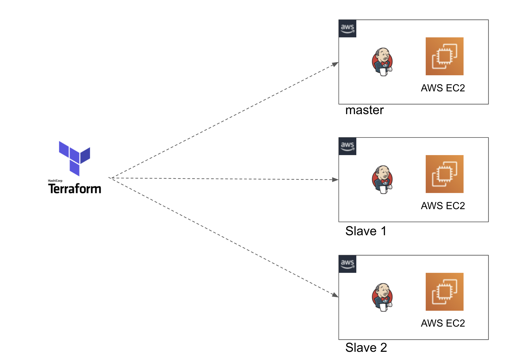

# Jenkins on aws EC2

This project demonstrates automatic infrastructure provisioning of three AWS EC2 instances for Jenkins use.

1 master & 2 slaves. 



Using Terraform (an Infrastructure as Code tool) to setup the EC2 instances and installs Jenkins onto them along with the required supporting tools. 

A bash script is loaded as template into user_data argument field in Terraform's `main.tf`.

This simple bash scripts installs a whole list of common supporting tools required by a CI/CD automation server (Git, Java, Maven, Gradle, Terrform, Packer, Ansible, and Docker etc.). Afterwards it runs the `jenkins.war` file on the Master Jenkins server.

## Usage

Below are commands to use this. 

Must have Terraform binary.

### Initialize Terraform

```bash
terraform init
```

### Plan the changes

```bash
terraform plan -var-file=varfile.tfvars
```

### Apply the changes
 
 ```bash
 terraform apply -var-file=varfile.tfvars
 ```

## Tests

I have used [awspec](https://github.com/k1LoW/awspec) to build RSpec tests. Currently, requires the infrastructure to be provisioned and the tests (at the moment just one simple test) will verify that it has been provisioned correctly.

Requires Ruby to be installed in your installed.

## Limitations

#### 1. Jenkins Restart
Also, Jenkins doesn't restart itself after a EC2 instance reboot. Will need to manually log on to the EC2 instance (master) to restart Jenkins again.

```bash
cd /opt/ && java -jar jenkins.war --httpPort=9000
```

#### 2. Using default VPC & Security Groups

As mentioned, for demo purposes i've intentionallly kept this simple. Therefore, I've used the default VPC in a region of my choice (eu-west-2=London). Additionally, I'm reusing a security group i've already got made which has certain ports open to the public (in this case, as indicated above, port 9000).

